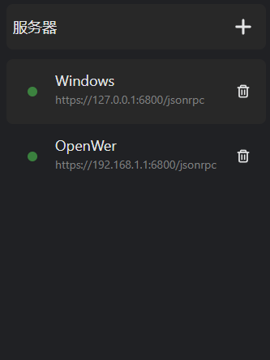
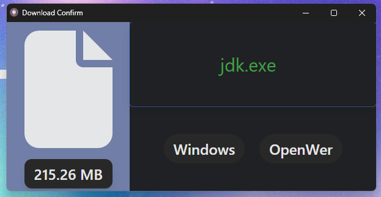

# Download with Aria2

**Download with Aria2** 拦截浏览器的下载, 发送链接到Aria2

## 📑 使用方式

1. 下载扩展, 配置Aria2地址 可以配置多个
 
   
3. 点击需要下载的文件 发送到配置的地址
 
   

## 🔒 隐私政策
本扩展会拦截浏览器下载任务和相关 Cookies 信息，发送到用户指定的 Aria2 服务端来完成下载。不会保存, 只在当前下载时有效.

## 📜 开源协议

Download with Aria2 is licensed under [BSD 3-Clause License](https://opensource.org/license/bsd-3-clause/).
